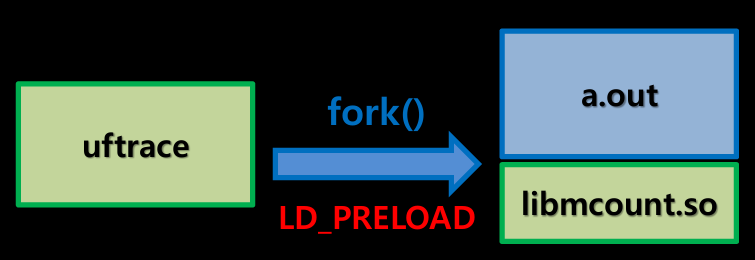
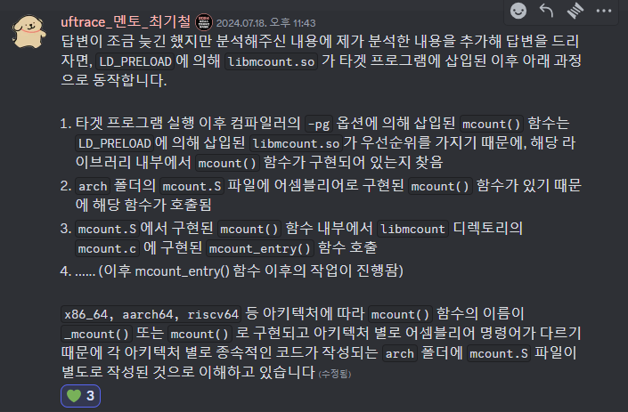
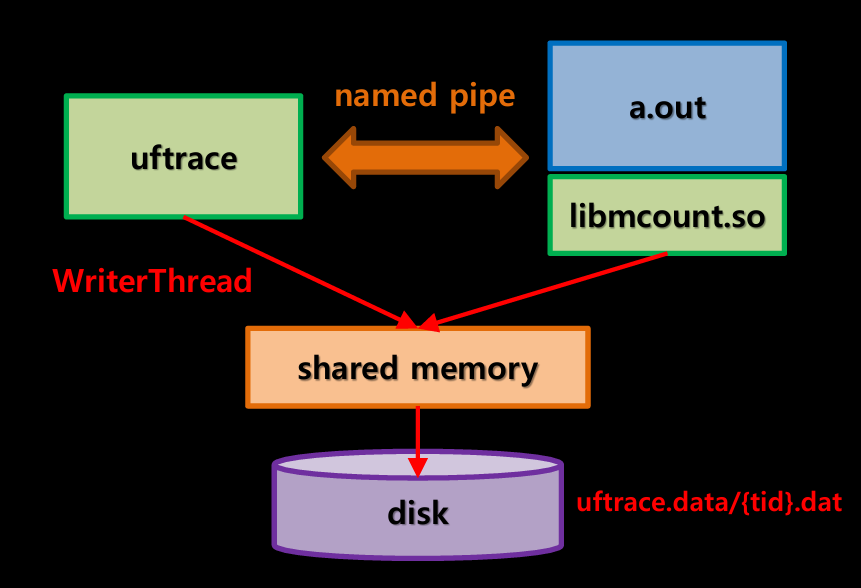
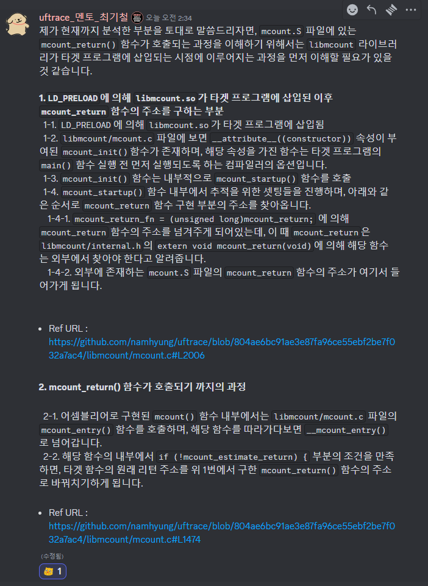
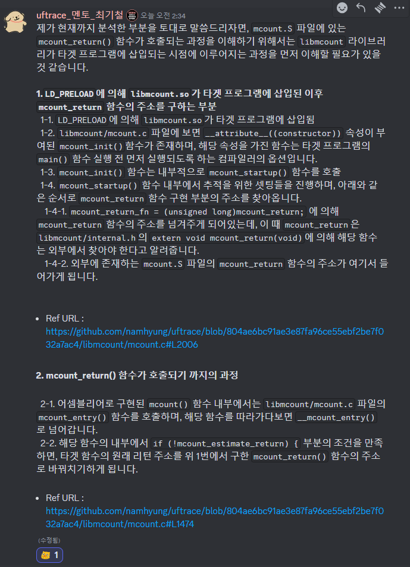

# 2024.07.17 
1. gcc에 option으로 mcount같은 trace 관련 함수를 호출하도록 컴파일하는 것 같음([youtube 영상으로 학습][uftrace강민철link])
2. mcount 같은 함수를 함수[프로파일러][프로파일링링크]라고 하는 것 같음
3. mcount는 [glibc][glibclink][.so][so파일link](GNU  C Library)의 [gmon][gmonlink]이라는 component에서 프로파일러로 동작하는 것 같다. 
4. mcount 같은 함수는 [ftrace][ftracelink]라는 리눅스 커널의 내장되어있는 기능으로도 활용되는것 같다.(uftrace가 이걸보고 기능을 확장한것같아 보이기도 함)
5. 이건 preload라는 방식으로 lib우선순위를 높여서 사용하는것 같다.
6. uftrace를 빌드하면 libmcount 폴더에 libmcount.so파일이 생긴다.
7. makefile을 잘 분석하면 libmcount에 어떤 c파일이 들어가있는지 확인가능할듯 싶다.

# 2024.07.18
1. [preload][preloadlink]의 개념을 이해하기 위해서는 [동적라이브러리][동적라이브러리link]의 개념부터 이해가 필요하다
2. 환경 변수 LD_PRELOAD를 변경하여 preload를 하는것 같다
3. getenv, setenv를 환경변수관련 라이브러리함수를 사용하여 설정한다.

4. 환경변수 설정이후 execv(filename)으로 .out파일을 실행시킨다.
5. 여기서 .out파일의 mcount()가 mcount.s로 부터 시작하여 libmcount폴더의 mcount_entry함수로 이어진다.

6. limcount폴더의 코드들은 uftrace코드와 메모리를 공유하여 있어 .out파일을 정보를 가져올수있게 한다.

# 2024.07.19
1. execv(opts->exename, argv)는 recode와 live에서 실행된다.
2. mcount()함수에서 call trace 관게를 알수 있는 방법은 실행(추적?)중인 함수에서 mcount()가 호출 되었을때 stack에 쌓인 인자값, 부모함수 주소, 자식함수 주소, 리턴값 주소 정보를 확인할수 있다
3. 위 과정은 [ftrace][ftracelink] 설명에 자세히 나와있다.
4. 시간값을 구하기 위해서는 실행중인 함수가 return할때 한번더 함수를 실행해줘야 하는데 이를 위해 return후 돌아가는 주소가 담기 stack에 mcount_return()주소로 바꿔치기하고 mcount_return() 돌아가는 주소를 실행함수의 돌아가는 주소 바꿔치기하여 끝나는 시점에 부모와 자식 함수 사이에 함수 호출이 가능하게 한다.

5. mcount_return()함수의 주소를 구하기 mcount_init()호출되어 mcount.S의 mcount_return 함수를 mocount_return_fn으로 넘겨준다. 이 작업 왜 필요한지 동적 라이브러리와 관련이 있는지 않을까 추정하고 있다.
6. mcount_init() 어디서 호출되는지 아직 파악이 필요한데 a.out에 __monstartup으로 점프하는 명령어가 아닐까 추정하고있다.

# 2024.07.20
0. 2024.07.19 스터디 내용 5. 6. 을 디스코드로 멘토님께 질문하여 답변을 받음

1. mcount_init() 함수는 a.out의 동적 라이브러리 init()에서 plt hooking을 으로 실행된다.

2. uftrace a.out의 실행 순서를 기본 기능 원리 중심으로 생각해보면 아래와 같다
    1. uftrace에서 setenv함수를 실행 LD_PRELOAD 값의 path를 libmocunt폴더로 변경하여 a.out실행시 glibc.so대신 libmcount.so가 실행되도록 설정한다.
    2. a.out가 실행되고 main()함수가 실행되기 전에 libmcount.c의 mocount_init()함수가 실행되고 이 안에서 mcount_return()의 주소를 저장함
    3. a.out main()이 실행되고 그 이후에는 각 함수(main()을 포함)가 실행될때마다 mcount()함수가 실행되어 mcount 함수에서는 입력값, 부모함수주소, 자식함수주소(본인), 반환값 주소를 확인함.
    4. 또한 자식함수주소에 리턴이후 돌아가는 함수의 주소를 mcount_retune()주소 변경하여 함수가 끝난후 mcount_return()이 실행되도록함
    5. mcount_return에서는 mocunt()가 실행된 시점의 시간과 mcount_return()실행된 시간을 차이를 구하여 자식함수의 실행시간을 측정할수 있게됨
    6. 위 과정들을 모두 메모리에 저장하고 a.out실행 종료후 저장된 메모리를 잘 가공하여 상황에 맞게 uftrace에서 출력해서 terminal로 출력해줌

# 2024.07.21
1. OSSCA 모임이 있어(불참하였지만) 디스코드 방에 자료가 올라와 해당 내용진행
2. 코드 스타일을 위해 pre-commit 설치, 가이드에는 파이썬으로 다운로드 되게 되어있지만 리눅스 환경에서는 sudo apt~~~~ 명령어를 이용하여 설치함
3. 기여 방법이나 First 이슈에 대해서 살펴봤지만 현재로서는 충분히 이해하기 어려움
4. ssh를 통한 원격 서버 접속으로 window에서 Linux 환경 폴더로 VScode를 확장을 사용하여 접근 시도하였으나 실패

# 2024 07.22
1. ssh 통한 원격 서버 접속 성공 (서버 추가할때 ssh 명령어를 입력하지 않아 발생함)
2. mcount.c의 __mcount_entry 함수를 살펴보며 uftrace로 shared memory를 통해 넘겨주는 변수들을 확인해보고자함
3. 일단 rstack변수에 주요 데이터가 들어가는것을 확인함. rstack의 depth, parent_loc, parent_ip, child_ip, start_time, end_time이 기본적인 Data로 보임
4. *parent_loc = mcount_return_fn 를 통해 리턴 주소바꿔치기(hijack)함
5. 함수하나하나 분석하는것은 아직 무리가 있어 주석을 통해 일단 함수의 기능을 이해고자
6. Access the mtd through TSD pointer to reduce TLS overhead라는 주석을 이해하기 위해 mtd TSD TLS에 대해 이해할 필요성을 느낌(리눅스 커널에 대한 지식 필요)
7. 책 임베디드 레시피 구매

# 2024.07.23
1. 리눅스 추천도서를 검색하던중 리눅스 커널에 대한 좋은 [무료강의][강의ULR]를 찾음
2. 12강중 1강을 들었으며 커널과 유틸의 차이를 이해하였고(메모리 레지던트, 디스크 레지던트) 시스템 콜의 개념을 이해함

# 2024.07.24
1. 리눅스 커널 강의 2강 수강
2. add(), sub() 함수를 예제를 어셈블리어로 확인하여 stack frame에 대한 이해도를 높임, 
3. 추가로 함수 호출시에 인자값을 레지스터에 넣는것이나 return 주소를 stack에 저장하고 스택 포인트를 어떻게 바꾸는지 확인함
4. 함수 반환시에도 반환값어디 레지스터에 넣는지, 스택 포인트가 어떻게 움직이고 반환주소를 어떻게 찾아가는지 등을 확인함
5. 다시한번 어셈블리 명령어마다 레지스터가 어떻게 움직이는 확인하고 싶음

# 2024.07.25
1. 리눅스 커널 강의 3강 수강
2. excalidraw로 지금까지 학습한것을 그림으로 정리, 일요일 전까지 배포 예정
3. 그림으로 정리중 동적 라이브러리 링크에 대해서 제대로 이해하지 못하고 있었음을 확인

# 2024.07.26
1. uftrace 자료정리 및 공유
2. plt hook에 이해하지 못하는 부분이 있었고 이를 이해하는 과정에 elf plt got에 대한 이해도를 높임

# 2024.07.27
1. uftrace 공유자료 피드백 받음
2. uftrace 프로파일링 관련 원리 정리 및 공유

# 2024.07.28
1. 디스코드에 올라온 자료 mcount 바꿔치기에 대한 내용 학습
2. 피드백 받은 공유자료 노션으로 다시 작성하여 pdf로 공유함
3. 이제부터 학습 정리를 노션으로 하고 excalidraw는 사진 자료 편집으로 사용할 예정

# 2024.07.29
1. 디스코드에 올란온 자료 plt hooking과 다이나믹 트레이싱 학습
2. 다이나믹 트레이싱을 이해하고 uftrace를 uftrace로 트레이싱 해봄

# 2024.07.30
1. 금일 추가로 올려주신 자라 학습
2. gdb를 활용한 디버깅 방법 실습
3. 함수가 호출되는 과정에서 Stack Frame에 Data가 어떻게 되는 확인

[so파일link]: https://snowjeon2.tistory.com/18
[프로파일링링크]: https://ypangtrouble.tistory.com/entry/%ED%94%84%EB%A1%9C%ED%8C%8C%EC%9D%BC%EB%A7%81
[ftracelink]: https://www.bhral.com/post/linux-kernel-ftrace-%EA%B0%84%EB%8B%A8%ED%95%9C-%EC%9B%90%EB%A6%AC
[glibclink]: https://www.gnu.org/savannah-checkouts/gnu/libc/index.html
[gmonlink]: https://www.gnu.org/software/libc/manual/html_mono/libc.html
[uftrace강민철link]: https://www.youtube.com/watch?v=mLhZz0Ibpno&t=405s
[preloadlink]: https://ar9ang3.tistory.com/8
[동적라이브러리link]: https://jjang-joon.tistory.com/28
[강의ULR]: https://olc.kr/course/course_online_view.jsp?id=35&s_keyword=Kernel&x=0&y=0#self
